# Project Description

In this project, we continue working with the Bank Marketing dataset.
We had to upload a new dataset from the local cloud machine to the azure machine learning studio.
We will use Azure to configure a cloud-based machine learning production model, deploy it, and consume it. 
We will also create, publish, and consume a pipeline. 

Project main steps

Authentication

Automated ML Experiment

Deploy the best model

Enable logging

Swagger Documentation

Consume model endpoints

Create and publish a pipeline

Documentation

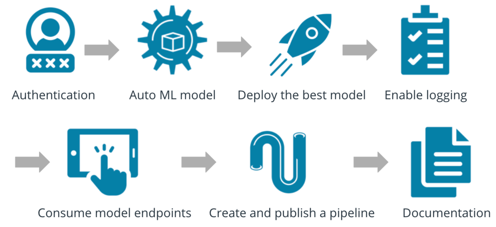

## Architectural Diagram

### Step 1

There is nothing I had to implement for this step since I used the Udacity Azure environment.

### Step 2

The dataset can be seen in the following screenshot.
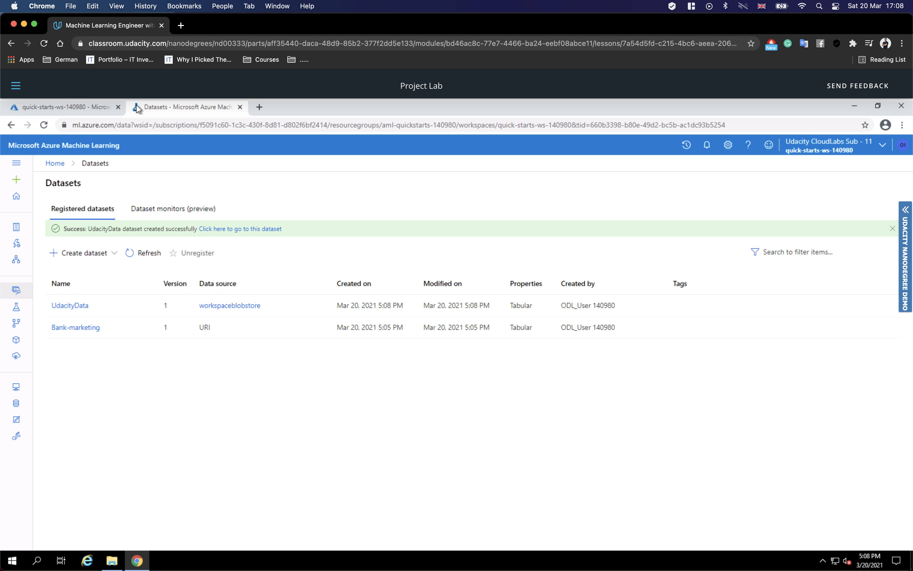

We first have to create a cluster for our autoML to be able to run.
We can see the options for the Cluster in the following image
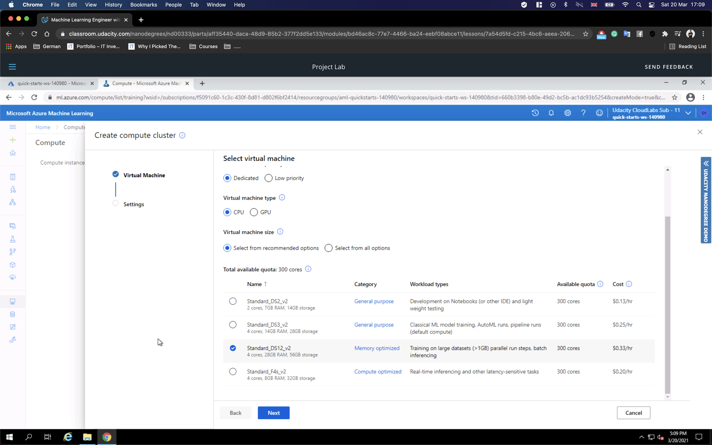

In the following 2 screenshots we can see AutoML run under the UdacityAutoML experiment and its complet
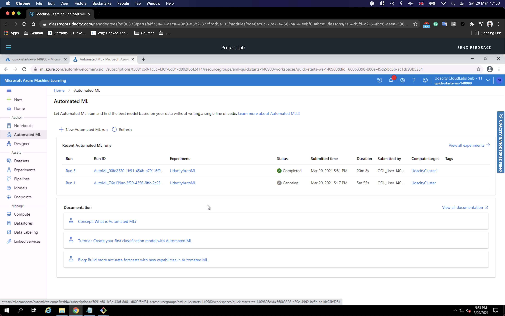
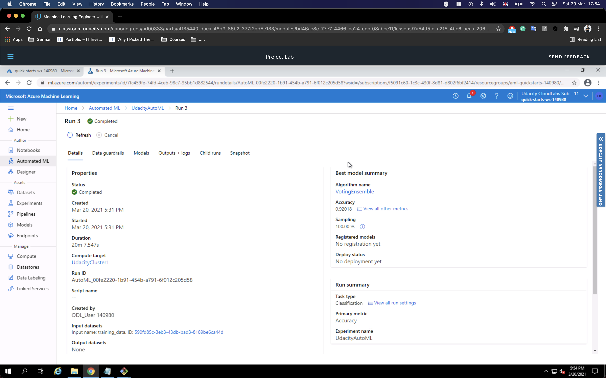

The best model is the a VotingEnsemble one.
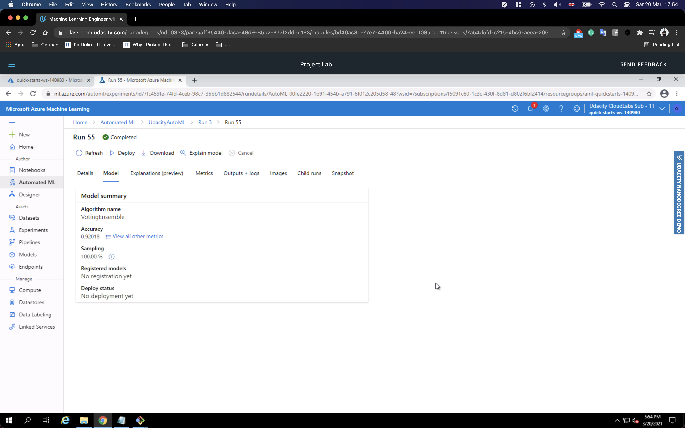

### Step 3

In the next step we have to deploy the best model with having enabled Authentication and using an ACI

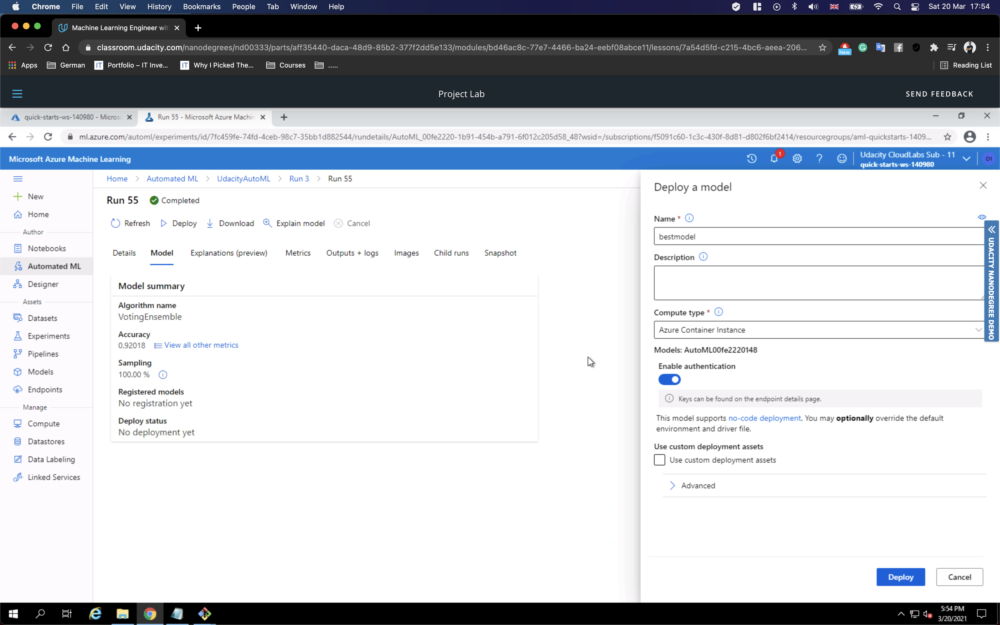

### Step 4

In the step 4 we have to enable the application insights for the deployed model.
We do that by running the log.py file.

The output log from the file can be seen in the screenshot below.
Also  the enable application insights can be seen as TRUE in the endpoint side.

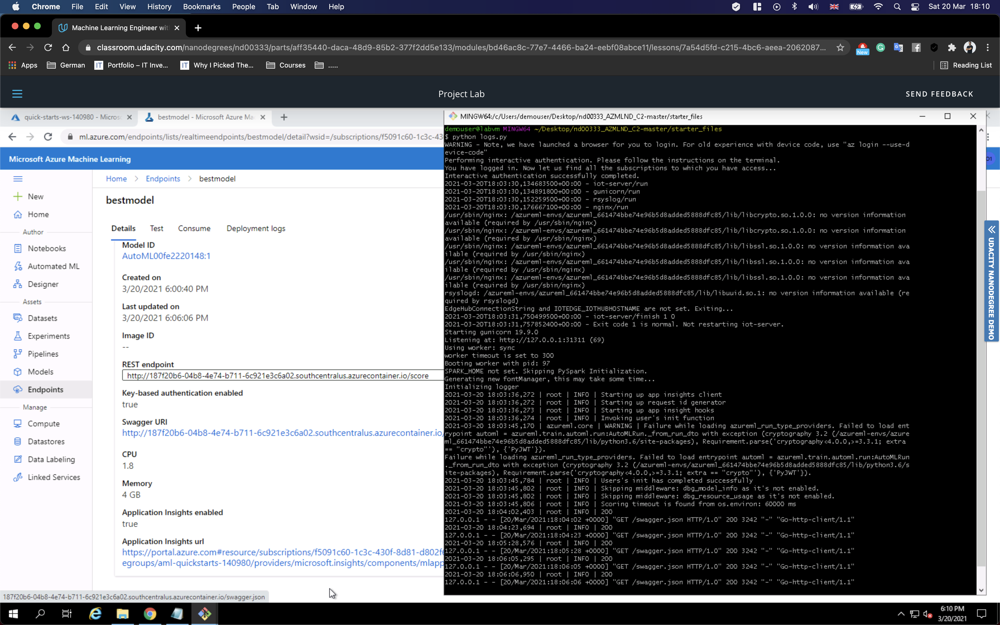

### Step 5

Next step is to enable te swagger documentation.
We have o download the swagger.json file from the endpoint in Azure ML studio.
Then run the swagger.sh and serve.py  files
In the first and second screenshot we can see the swagger documentation in port 9010 (port 80 was used from another application)
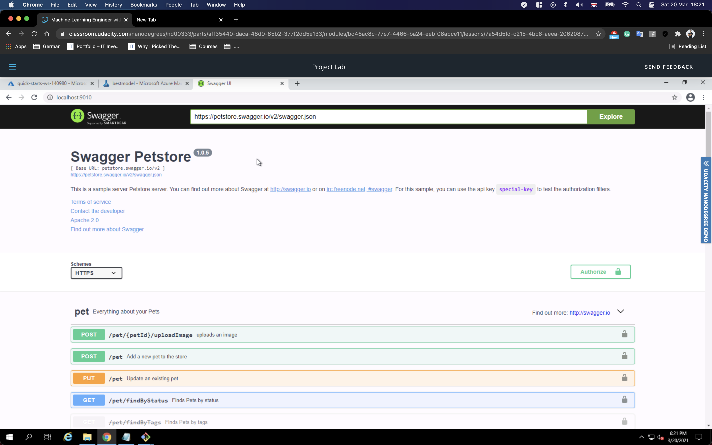

The next two screenshots give us an idea of the documentation for the post and get methods. 
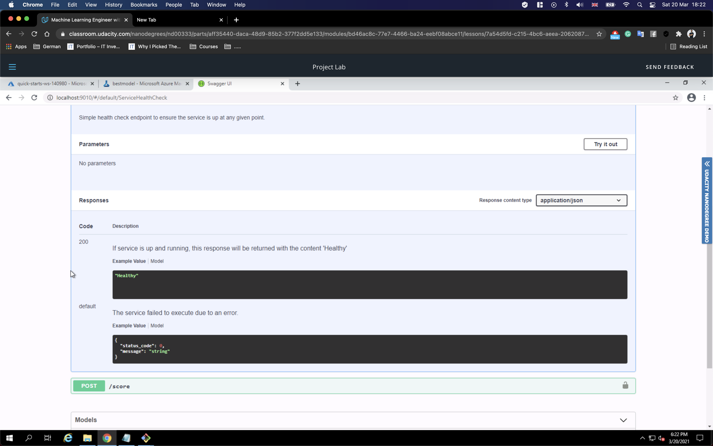
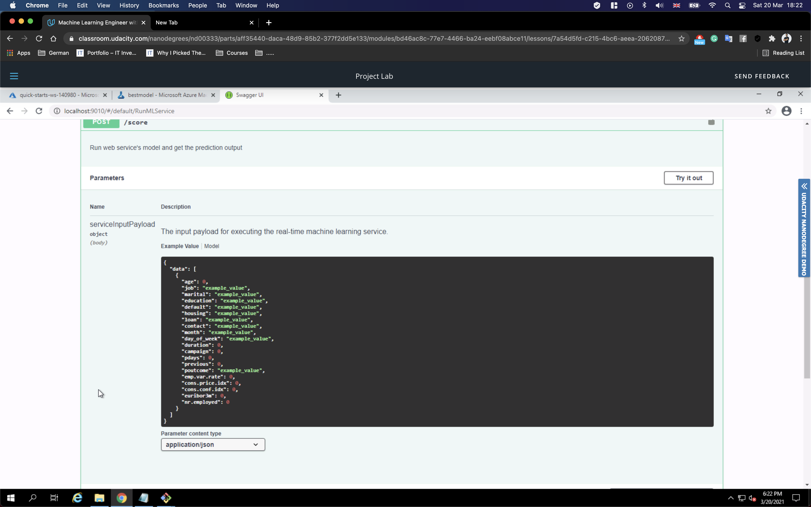

### Step 6

The last step is to try and test the live model.
We are running the endpoint.py file and that will provide two example for the model to be tested.
In the screenshot we can see the output of the model

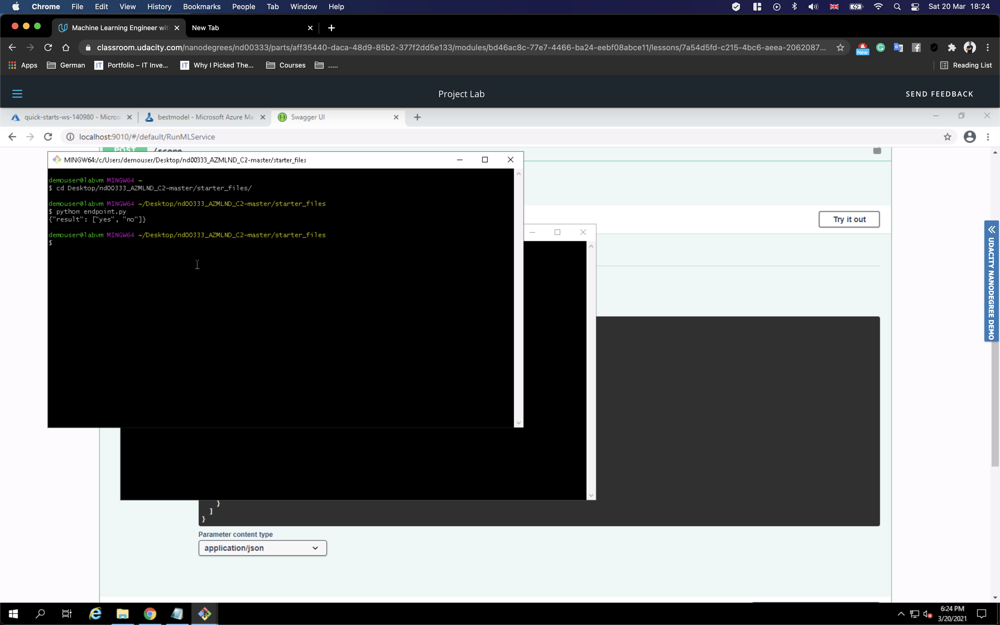

### Step 7

After we have completed everything once and in manual way the only logical next step is to create a pipeline to automate all the steps.
In order to do that we have been provided already with a .ipynb file with the necessary code.
After made a few adjustments for the experiments names and the cluster names in the notebook we can see the run details Widget

And that the run is complete 

Bank Marketing dataset with the AutoML module

Information about the published endpoint of the pipeline

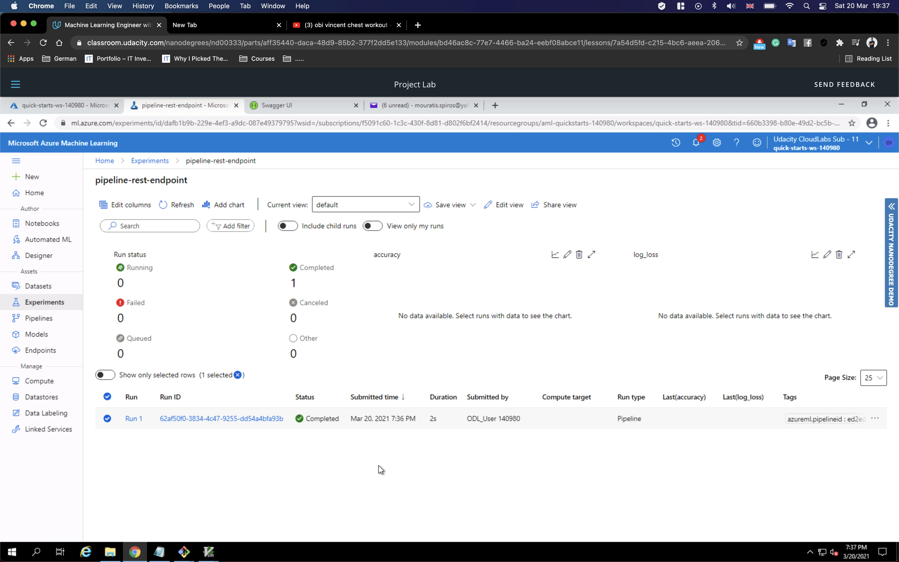
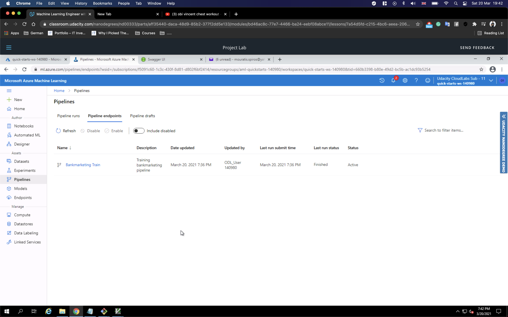
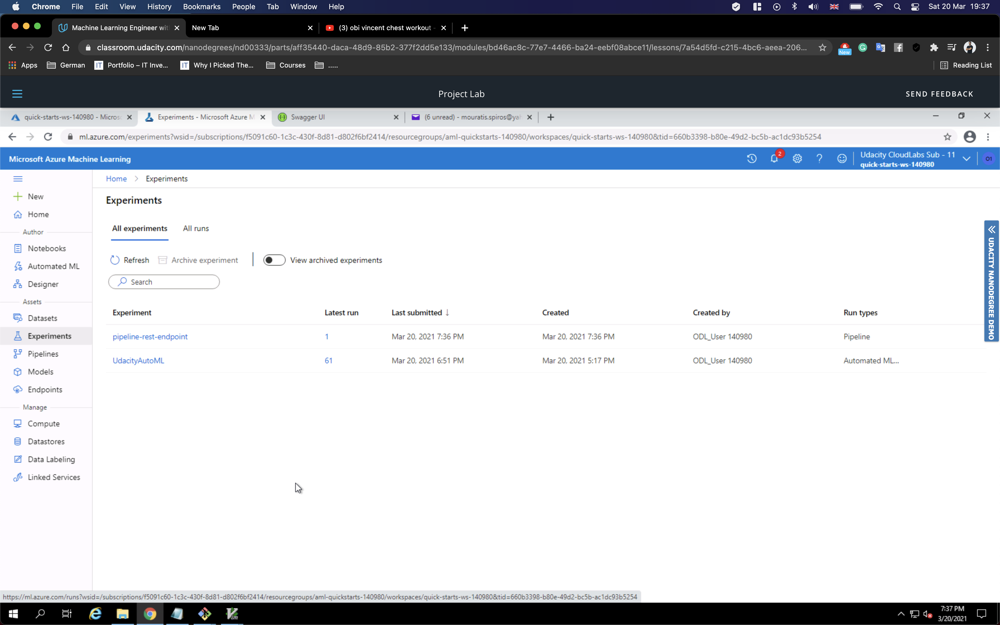

## Screen Recording

The screen recording can be found here https://drive.google.com/file/d/1rO6lIP7JEsfprXK9hjhfaeRW-u_cFzFn/view?usp=sharing

## Standout Suggestions

Enable Deep learning.

The dataset has issues with imbalance in the training data and needs to be tackled.

Feature engineering is also something which can be explored in the a later step.