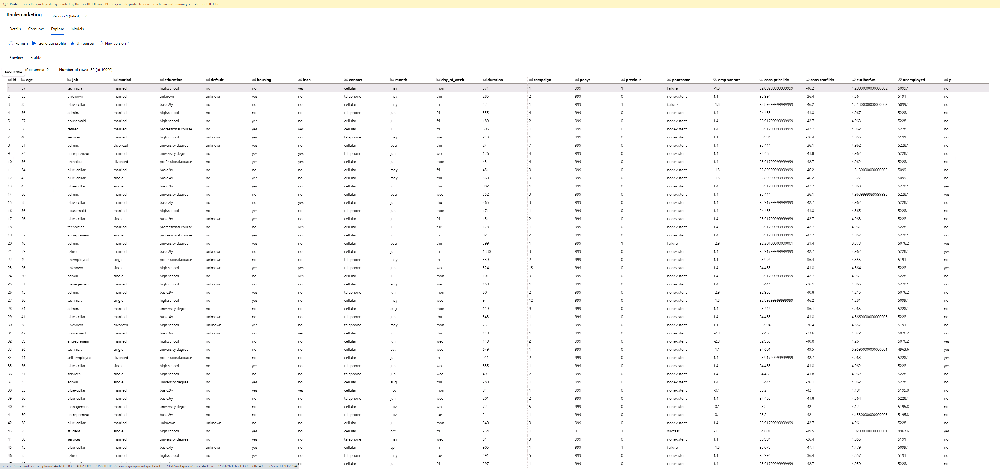

*NOTE:* This file is a template that you can use to create the README for your project. The *TODO* comments below will highlight the information you should be sure to include.

# Project Description

In this project, we continue working with the Bank Marketing dataset.
We will use Azure to configure a cloud-based machine learning production model, deploy it, and consume it. 
We will also create, publish, and consume a pipeline. 

Project main steps

Authentication

Automated ML Experiment

Deploy the best model

Enable logging

Swagger Documentation

Consume model endpoints

Create and publish a pipeline

Documentation

## Architectural Diagram

### Step 1

There is nothing I had to implement for this step since I used the Udacity Azure environment

### Step 2

The dataset can be seen on the top right corner of the image below

The experiment can be seen in the image below

The best model can be seen in the image below

### Step 3

### Step 4

### Step 5

### Step 6

### Step 7

## Key Steps
*TODO*: Write a short discription of the key steps. Remeber to i

## Screen Recording
*TODO* Provide a link to a screen recording of the project in action. Remember that the screencast should demonstrate:

## Standout Suggestions
*TODO (Optional):* This is where you can provide information about any standout suggestions that you have attempted.
